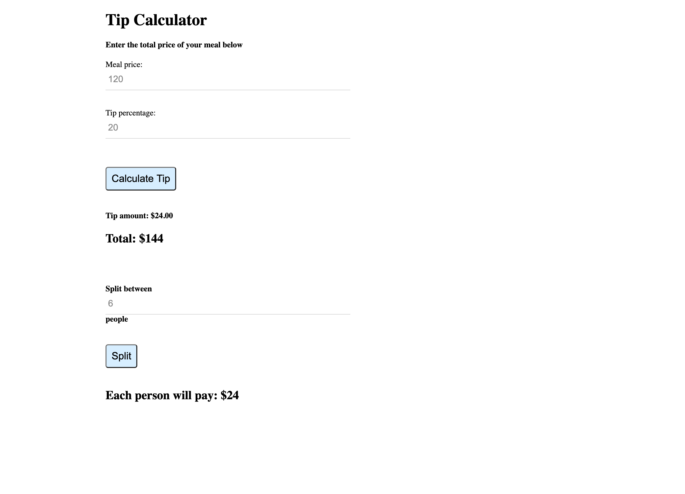

# Tip Calculator

  
  

## Description 

This application allows you to calculate the total cost of a meal given a tip percentage. If the meal is shared between multiple people, there is an option to split the bill evenly among each person.

See the URL for the deployed application: https://meierj423.github.io/tip-calculator/

## Table of Contents

* [License](#license)
* [Questions](#questions)

## License

This application is covered under the MIT license.

## Questions

For any additional questions, please send me an e-mail at jackson.meier423@gmail.com

Link to my GitHub: https://github.com/meierj423
